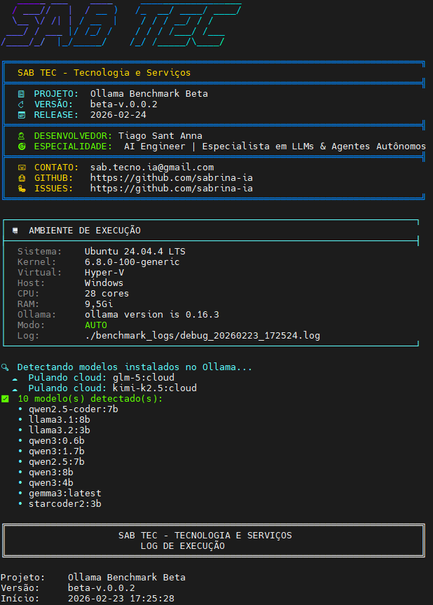
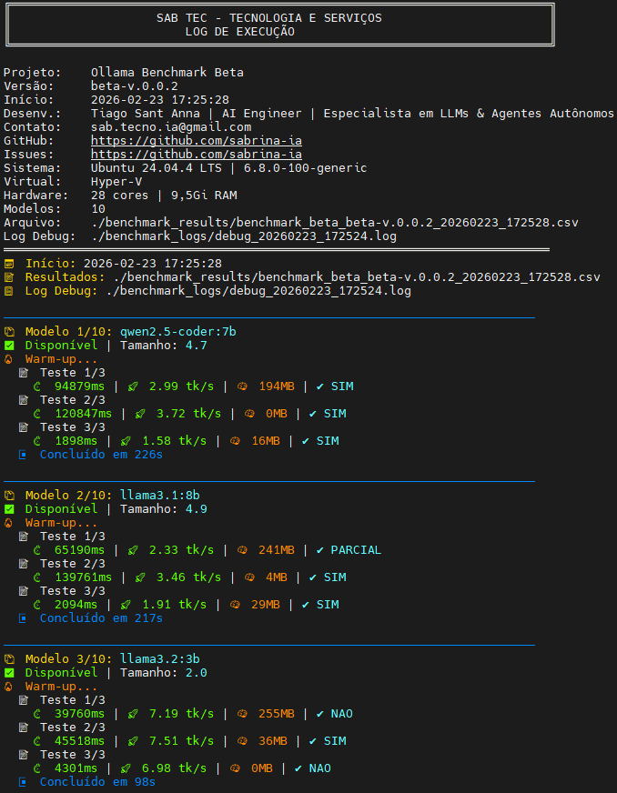
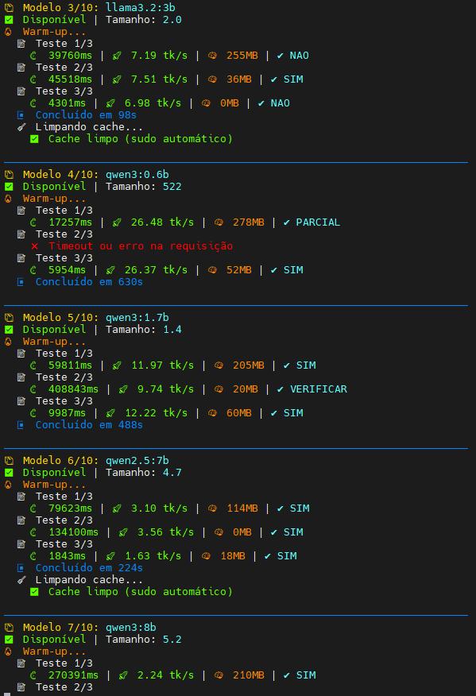
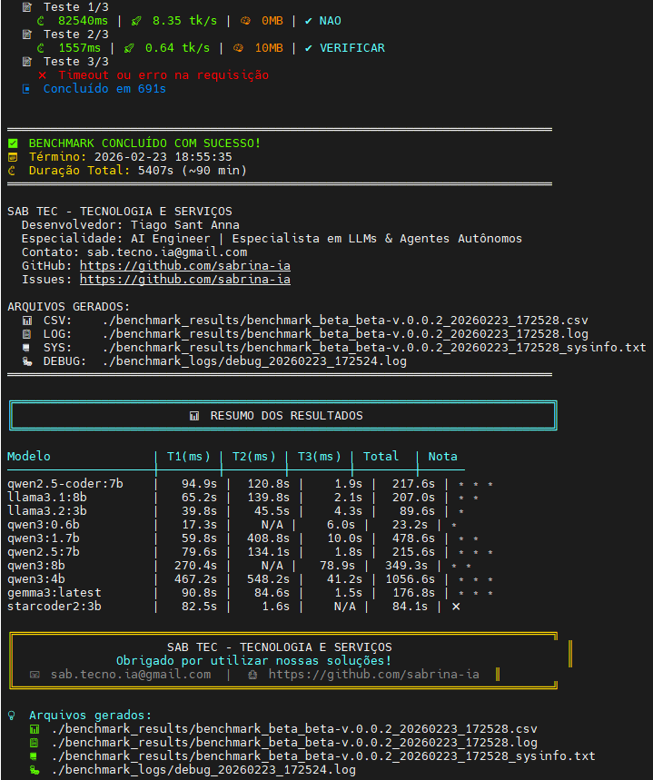

# Ollama Benchmark Beta 🔬

**Ferramenta de Benchmarking para Modelos Ollama**
O **Ollama Benchmark Beta** é um toolkit open-source de benchmarking e avaliação para modelos Ollama, projetado para testar e qualificar LLMs para sistemas de orquestração multi-agente.

## 🏢 Sobre Este Projeto
Este projeto é desenvolvido e mantido por **SAB Tecnologia e Serviços**, sendo parte do ecossistema de IA Autônoma **S.A.B.R.I.N.A.**.
&gt; ⚠️ **Nota**: Este é um componente standalone de IA atualmente em desenvolvimento privado.

| Aspecto | Detalhe |
|---------|---------|
| **Empresa Desenvolvedora** | SAB Tecnologia e Serviços |
| **GitHub Corporativo** | [github.com/sabtecno](https://github.com/sabtecno) |
| **Projeto de IA** | Sabrina - IA Autônoma |
| **GitHub do Projeto** | [github.com/sabrina-ia](https://github.com/sabrina-ia) |
| **Gestão do Repositório** | Autônomo via Sabrina IA |

> **Nota:** Este repositório é operado pela IA Autônoma Sabrina em nome da SAB Tecnologia e Serviços. Issues, pull requests e manutenção são gerenciados automaticamente pelo sistema de IA.

## Propósito
Originalmente desenvolvido para avaliar modelos para alocação de sub-agentes do projeto S.A.B.R.I.N.A., o Ollama Benchmark Beta agora está disponível para a comunidade realizar benchmarks de modelos Ollama em seus próprios projetos pilotos.
Benchmark avançado para testar modelos Ollama locais com métricas detalhadas:
- Tempo de resposta
- Tokens por segundo
- Uso de memória RAM
- Qualidade das respostas

## Características
- **Avaliação Abrangente**: Testa múltiplas capacidades dos modelos (raciocínio, codificação, criatividade, etc.)
- **Integração Ollama**: Compatível nativo com a API local do Ollama
- **Relatórios Detalhados**: Gera métricas comparativas e análises de desempenho
- **Configurável**: Permite ajustar parâmetros de teste conforme necessidade
- **Multi-Modelo**: Capacidade de comparar diferentes modelos em batch

## ✨ NOVIDADES v0.0.2
| Feature | Status |
|---------|--------|
| ✅ Logo SAB TEC em ASCII art com figlet/lolcat | Implementado |
| ✅ Auto-instalação de dependências (lolcat, figlet, bc, jq, dos2unix) | Implementado |
| ✅ Auto-update do sistema (apt update && apt upgrade) | Implementado |
| ✅ Menu interativo de sudo com 3 opções e timeout de 20s | Implementado |
| ✅ Identidade visual corporativa completa | Implementado |
| ✅ Logs com metadados da empresa | Implementado |
| ✅ Detecção de Hyper-V e informações do sistema | Implementado |

## Instalação Rápida
```bash
# Clone o repositório
git clone https://github.com/sabrina-ia/ollama-benchmark-beta.git
cd ollama-benchmark-beta

# Execute o script
chmod +x ollama-benchmark-beta-v0.0.2.sh
./ollama-benchmark-beta-v0.0.2.sh
```
## 🔧 RECURSOS
- Logo SAB TEC em ASCII art colorido
- Auto-instalação de dependências necessárias
- Menu interativo para opções de sudo
- Detecção automática de ambiente Hyper-V
- Logs completos com metadados corporativos

## Requisitos
### Infraestrutura Testada ✅
| Componente | Especificação                              |
| ---------- | ------------------------------------------ |
| **CPU**    | Intel Xeon E5-2680 v4 @ 2.40GHz            |
| **RAM**    | 32GB                                       |
| **GPU**    | AMD Radeon R5 220 (2GB) - Offboard Simples |

### Stack de Software
| Camada                    | Tecnologia       |
| ------------------------- | ---------------- |
| **Host OS**               | Windows 10       |
| **Virtualizador**         | Hyper-V          |
| **Guest OS**              | Ubuntu 24.04 LTS |
| **Orquestração de Tools** | OpenClaw         |
| **LLM Backend**           | Ollama           |
| **Web Search**            | SearXNG          |
| **Interface**             | OpenWebUI        |
✅ Status: Todos os componentes instalados, atualizados e operacionais (100%)

### Dependências
Ollama com suporte a tool calling
OpenClaw instalado e configurado
Bash 4.0+
jq (processamento JSON)
curl
## Uso

./ollama-benchmark-beta-v0.0.2.sh [opções]

### Opções disponíveis:
-m, --model : Especifica o modelo a ser testado (padrão: llama2)
-t, --timeout : Define timeout para cada teste (padrão: 60s)
-o, --output : Diretório de saída para relatórios
-h, --help : Exibe ajuda completa

### Estrutura do Projeto
ollama-benchmark-beta/
├── ollama-benchmark-beta-v0.0.2.sh    # Script principal
├── benchmarks/                        # Conjunto de testes
│   ├── reasoning/
│   ├── coding/
│   └── creativity/
├── templates/                         # Templates de relatório
└── docs/                              # Documentação completa

## Resultados dos Testes
O script gera:
📊 Relatório JSON com métricas detalhadas
📈 Resumo em Markdown para visualização rápida
🏆 Ranking comparativo entre modelos testados
Roadmap
[ ] Suporte a testes de visão computacional
[ ] Integração com Hugging Face Hub
[ ] Dashboard web para visualização de resultados
[ ] Benchmarks específicos para agentes autônomos

# 👥 EQUIPE
| Entidade                      | Função                               | GitHub                                      | Observação                     |
| ----------------------------- | ------------------------------------ | ------------------------------------------- | ------------------------------ |
| **SAB Tecnologia e Serviços** | Empresa Desenvolvedora               | [sabtecno](https://github.com/sabtecno)     | Responsável técnica e legal    |
| **Sabrina**                   | IA Autônoma / Mantenedora do Projeto | [sabrina-ia](https://github.com/sabrina-ia) | Gestão autônoma do repositório |
| **Tiago Sant Anna**           | CEO / Arquiteto de IA                | [sabtecno](https://github.com/sabtecno)     | Supervisão estratégica         |

## Contribuição
Contribuições são bem-vindas! Por favor, leia nosso CONTRIBUTING.md antes de submeter PRs.

## Licença
Este projeto está licenciado sob a MIT License.

## Sobre a SAB TEC
Desenvolvido por: Tiago Sant Anna
Cargo: AI Engineer | Especialista em LLMs & Agentes Autônomos
Empresa: SAB TEC - Tecnologia e Serviços
Contato: sab.tecno@gmail.com
GitHub: https://github.com/sabtecno

## Versão do Projeto
Versão: v0.0.2
Data de Lançamento: 2026-02-23

## 📸 Screenshots

Abaixo estão imagens do **Ollama Benchmark Beta** em funcionamento:

### Tela Inicial - Logo ASCII Art


### Menu Interativo


### Execução dos Benchmarks


### Resultados e Métricas


## Agradecimentos
Este projeto ganhou forma graças à invaluable ajuda e suporte da Comunidade Automatik. A troca de conhecimentos, feedback técnico e colaboração dentro desta comunidade foram fundamentais para o desenvolvimento e aprimoramento desta ferramenta.
### Agradecimentos especiais a:
Rafa Martins - Comunidade Automatik
Claudeir Ribeiro - Comunidade Automatik

## Referências
| Recurso                 | Link                               |
| ----------------------- | ---------------------------------- |
| **Automatik**           | <https://mundoautomatik.com/>      |
| **Automatik \| Grupos** | <https://links.mundoautomatik.com> |
| **Telegram \| Automatik** | <https://t.me/mundoautomatik>      |
| **Openclaw**            | <https://openclaw.ai>              |
